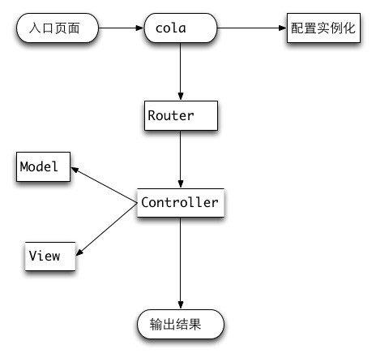

##cola php

工作中用了很多框架，也写过一些简单的框架，一直想分析一个开源的框架

选择cola php为目标是因为他足够简单，而且作为一个web的php框架，基本够用了。

谢谢群超的colaphp框架。

写了一个简单的cola php的文档


###php框架通用的组成部分
公共的部分：

	入口类-管理资源
	配置类-处理配置
	router-路由类
	controller类
	model类
	view类
	http类 处理http请求
	

### cola php的运行流程


大致流程：

	1 加载入口文件
	2 在入口文件处实例化Cola对象-同时加载配置类
	3 加载路由配置，如果有配置路由，走配置路由，否则加载入口的路由
	4 加载Controller类和你自己的xxController类
	5 加载需要的xxModel类
	6 加载你的脚本显示结果

### 可运行的cola php的配置

不修改你的服务器配置，默认的路由的url格式是，当然你也需要配置nginx

	http://cola.other.program.php/index.php/Index/tt
	


如果你需要默认的url格式为
	
	http://cola2.other.program.php/index/index

你需要进行如下配置，需要设置nginx里面的PATH_INFO变量
这个变量会在$_SERVER["PATH_INFO"]里面被接收到


```
 server {
        listen       80; 
        server_name  cola2.other.program.php;
        root /Users/kang/Documents/phpProject/otherproject/colaphp/app;
        index  index.html index.htm index.php;

        access_log  /Users/kang/Documents/var/log/access.log;


        #error_page   500 502 503 504  /50x.html;
        location = /50x.html {
            root   html;
        }   
    

        location ~ / { 
        	  //新增的一段rest风格重新
            if (!-e $request_filename) {
                rewrite ^/(.*)$ /index.php/$1 break;
            }   

            fastcgi_pass   127.0.0.1:9000;
            fastcgi_index  index.php;
            fastcgi_param SCRIPT_FILENAME $document_root$fastcgi_script_name;
            include        fastcgi_params;
            include         fastcgi.conf;
            fastcgi_split_path_info ^((?U).+\.php)(/?.+)$;
            fastcgi_param  PATH_INFO        $fastcgi_path_info;
        }   
        location ~ /\.ht {
            deny  all;
        }   
    } 
```

下载框架源码，你就可以正常的使用这个框架了


