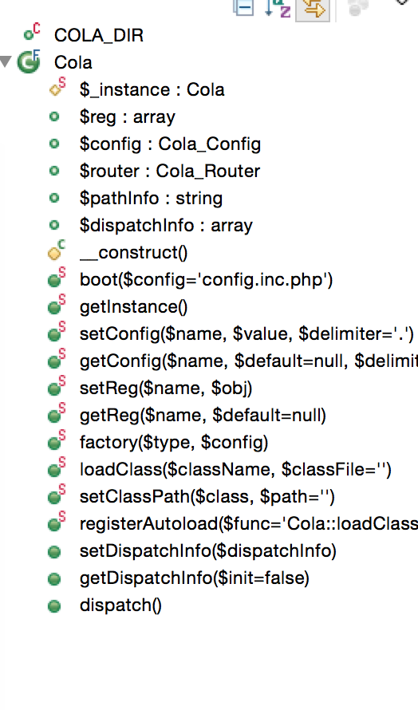

##cola-php框架的类分析(一)

###入口类Cola




属性分析

	$_instance 单例模式，持有cola对象
	$reg 存储变量和对象
	$config 配置对象
	$router 路由对象
	$pathinfo 存储路由的路径
	$dispatchInfo 存储需要加载的控制器和方法	

构造方法

	1 注册默认需要的类
	2 加载自动加载方法

```
//初始化配置类
        $this->config = new Cola_Config(array(
            '_class' => array(
                'Cola_Model'               => COLA_DIR . '/Model.php',
                'Cola_View'                => COLA_DIR . '/View.php',
                'Cola_Controller'          => COLA_DIR . '/Controller.php',
                'Cola_Router'              => COLA_DIR . '/Router.php',
                'Cola_Request'             => COLA_DIR . '/Request.php',
                'Cola_Response'            => COLA_DIR . '/Response.php',
                'Cola_Ext_Validate'        => COLA_DIR . '/Ext/Validate.php',
                'Cola_Exception'           => COLA_DIR . '/Exception.php',
                'Cola_Exception_Dispatch'  => COLA_DIR . '/Exception/Dispatch.php',
            ),
        ));
        Cola::registerAutoload();
```

自动加载方法loadClass($className, $classFile = '')，支持按照文件和方法查找
	
	1 看是否已经存在
	2 classFile不存在，在默认的类中查找
	3 如果类名字中有Cola 去掉它。例如Cola_Ext_Http类
		去掉Cola把_替换成\  xxx\Ext\Http文件
	4 然后需要配置 model controller 加载对应的类


其实代码需要指定对应的controller，model，view，widget路径


```
   '_modelsHome'      => APP_PATH.DIRECTORY_SEPARATOR.'model',
    '_controllersHome' => APP_PATH.DIRECTORY_SEPARATOR.'controller',
    '_viewsHome'       => APP_PATH.DIRECTORY_SEPARATOR.'view',
    '_widgetsHome'     => APP_PATH.DIRECTORY_SEPARATOR.'widget'
```
 
入口代码是这么写的 
```
//分发 CONFIG_PATH 配置路径
$cola->boot(CONFIG_PATH)->dispatch();
```

boot(CONFIG_PATH) 主要是加载配置文件合并配置。下面我们讲到config类的时候会做一个说明


初始化cola对象，boot配置后，我们会有一个dispatch，这个时候我们主要考虑的是加载对应的controller和action


getDispatchInfo方法是获取dispathch的
	
	1 如果不存在dispatchInfo，实例化Router
	2 获取配置里面_urls数组和router实例里面的rules合并
	3 获取pathInfo，然后去router里面匹配
	4 加载对应的controller文件和对象，调用对应的方法


dispathch最后的结构是类似这一种的哦
```
 [dispatchInfo] => Array
        (
            [controller] => IndexController
            [action] => indexAction
        )
```


setConfig和getconfig主要是调用config对象的方法

setReg($name, $obj) 注册对象或者参数

setClassPath 往配置里面加入加载路径

setDispatchInfo 设置变量


factory实例化一个类，当然咱们也可以直接不用factory实例化，

我觉得这个地方可以再加个是否setReg的配置，复用这个类,恩，在代码里面已调整

```
public static function factory($type, $config)
    {
        $adapter = $config['adapter'];
        $class = $type . '_' . ucfirst($adapter);
        return new $class($config);
    }
```


